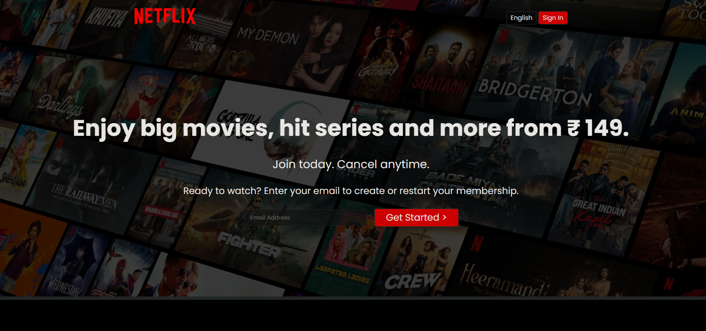
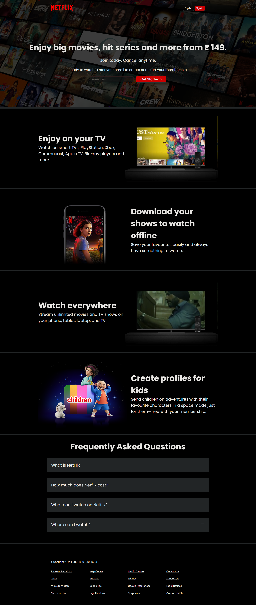
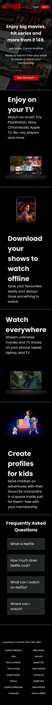

<h1 align="center">🎬 Netflix India Homepage Clone</h1>

  A visually rich and responsive clone of the Netflix India homepage built using pure <strong>HTML</strong> and <strong>CSS</strong>.

  

---

## 🔗 Live Demo

🚀 [Click here to view the live site](https://github.com/Krishnna1909/Netflix_Clone)  

---

## 🧰 Tech Stack

- HTML5
- CSS3 (Media Queries & Flexbox)
- Google Fonts
- Responsive Web Design Principles

---

## ✨ Features

- 🔴 Hero section with background image and call-to-action
- 📺 TV showcase with video playback overlay
- 📱 Mobile section for offline downloads
- 👶 Kids profile section with unique UI
- ❓ Interactive FAQs with expand effects
- 🦶 Fully responsive design across all screen sizes
- ⚙️ Clean and modular code structure

---

---

## 📸 Screenshots

### Desktop View

### Mobile View

---

## 🎯 Learning Outcomes

- Mastered layout with Flexbox
- Practiced responsive design with media queries
- Replicated real-world UI from scratch
- Improved design consistency and attention to detail

---

## 📚 Inspiration

This project is inspired by the official [Netflix India homepage](https://www.netflix.com/in/), rebuilt for learning and portfolio showcase purposes.

---

## 🙋‍♂️ Author

- 💻 **Krishna Singh**
- 🔗 GitHub: [@Krishnna1909](https://github.com/Krishnna1909)
- 🌐 LinkedIn: [Krishna Singh](https://www.linkedin.com/in/krishna-singh-328317299/)

---

## ⭐ Show Some Love

If you found this project useful or inspiring, please give it a ⭐ and consider following me for more!
